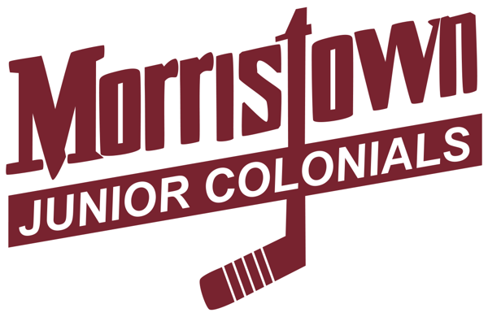

# Youth sports stats dashboard

A single-page site that pulls a player's stats from a Google Sheet and displays them in a broadcast-style layout with career highlight tiles, career stats and a game log. It works on phones, tablets and desktops. Free to host on GitHub Pages.

The template is set up for hockey but works for any sport. The tables display whatever columns are in your Google Sheet — change the headers and the page adapts. The only hockey-specific piece is the stat highlight tiles, which look for columns named **GP**, **G**, **A** and **Pts**. To use this for another sport, update those four column lookups and tile labels in the JavaScript (see [Adapting for other sports](#adapting-for-other-sports) below).

**Demo:** [Lucas Lyon-Stirling](https://sstirling.github.io/lls/)

---

## What you'll need

- A Google account
- A GitHub account ([sign up here](https://github.com/join))
- A player headshot photo (optional)
- A team logo image (optional)

No coding experience is required. You'll copy a template, change a few lines of text and upload.

---

## Step 1: Set up the Google Sheet

The site pulls from a Google Sheet with two tabs: **Game Log** and **Career Stats**. The tab names must match exactly.

1. Open [this template spreadsheet](https://docs.google.com/spreadsheets/d/1u-AnmAe-NW9YBbZC_631x7AAaMOitwTpvWGe8FB3XaA/copy) and click "Make a copy."
2. Fill in the **Game Log** tab with one row per game. Use whatever columns make sense for your sport (date, opponent, goals, assists, points, etc.).
3. Fill in the **Career Stats** tab with one row per season. Use whatever stat columns your sport needs — all columns will appear in the table. For the highlight tiles at the top of the page, the default template looks for **GP**, **G**, **A** and **Pts**. If your sport uses different stats, see [Adapting for other sports](#adapting-for-other-sports).
4. Share the spreadsheet: click **Share**, then set access to **Anyone with the link** as **Viewer**.
5. Copy the spreadsheet ID from the URL. It's the long string between `/d/` and `/edit`:

```
https://docs.google.com/spreadsheets/d/THIS_IS_YOUR_SHEET_ID/edit
```

**Privacy note:** Anyone who views your page source can see the sheet ID and query any tab in the workbook. Only put data in this spreadsheet that you're comfortable being public.

---

## Step 2: Customize the HTML

1. Download or copy the `index.html` file from this repository.
2. Open it in any text editor (TextEdit on Mac, Notepad on Windows, or a code editor like VS Code).
3. Make these changes:

### Spreadsheet ID (required)

Find this line near the top of the `<script>` section:

```js
const SHEET_ID = '14-EDcgY2vjO37V_cuVebjrlRlSX-6nIK229vcMJZitw';
```

Replace the ID with yours.

### Player info (required)

Find the hero section and update the player name, position, age and team:

```html
<h1 class="player-name">Lucas Lyon-Stirling</h1>
<p class="player-meta">LW, C &middot; Age 10 &middot; Morristown Junior Colonials</p>
```

### Season label (required)

Find this line and update it to the current season:

```html
<h2 class="section-title">Fall 2025 Game Log</h2>
```

### Headshot (optional)

Find the headshot `div` and replace the image URL with a path to your photo. If you place the photo in the same folder as `index.html`, you can use just the filename:

```html
<div class="headshot" style="background-image: url('headshot.jpg');"></div>
```

### Team logo (optional)

Place your logo file in the same folder and update this line:

```html

```

If you don't have a logo, you can delete the `` line entirely.

### Page title (optional)

Update the `<title>` tag in the `<head>`:

```html
<title>Your Player Name - Player Stats</title>
```

### Social card image (optional)

When someone shares the link on iMessage, Slack, Facebook or X, a preview image and description will appear. To customize this, place a photo in the same folder and update the `og:image` and `twitter:image` meta tags in the `<head>`. Use the full URL where your site will be hosted:

```html
<meta property="og:image" content="https://yourusername.github.io/player-stats/your-photo.jpg">
<meta name="twitter:image" content="https://yourusername.github.io/player-stats/your-photo.jpg">
```

You can also update the `og:title`, `og:description`, `twitter:title` and `twitter:description` tags with your player's name and team. If you don't want a social card, delete the `<!-- Social card -->` block entirely.

---

## Step 3: Publish to GitHub Pages

1. Log into [GitHub](https://github.com) and click **New repository**.
2. Name it something like `player-stats`.
3. Set it to **Public**.
4. Click **Add file > Upload files**.
5. Upload `index.html`, your headshot and your logo (if using).
6. Click **Commit changes**.
7. Go to **Settings > Pages**.
8. Under "Source," select the **main** branch and **/ (root)** folder, then click **Save**.
9. After about a minute, your site will be live at:

```
https://yourusername.github.io/player-stats/
```

---

## Updating stats

Edit the Google Sheet and the page updates automatically. No need to touch the code or re-upload anything.

When a new season starts:
1. Add a new row to the **Career Stats** tab. The highlight tiles will recalculate.
2. Clear the **Game Log** tab and start fresh, or rename the tab and create a new one (update the tab name in `index.html` if you do).
3. Update the season label in `index.html` (e.g., "Spring 2026 Game Log").

---

## Customization ideas

- **Colors:** Change the color variables at the top of the `<style>` section. `--color-primary` controls the header and accent tile; `--color-accent` controls the blue highlights.
- **Additional stats tabs:** Add a new tab to the Google Sheet (e.g., "Tournament Stats"), add a new section in the HTML and add another `loadSheet()` call in the JavaScript.
- **Custom domain:** GitHub Pages supports custom domains. See [GitHub's guide](https://docs.github.com/en/pages/configuring-a-custom-domain-for-your-github-pages-site).

---

## Adapting for other sports

The tables work for any sport with no code changes — they display whatever columns are in your Google Sheet. The only part that needs updating is the five stat highlight tiles at the top.

In the `<script>` section of `index.html`, find the `computeCareerTotals` function. Update the column lookups to match your sheet's headers:

**Hockey (default):**
```js
const gIdx = findCol('GP', 'Games');
const goIdx = findCol('G', 'Goals');
const aIdx = findCol('A', 'Assists');
const pIdx = findCol('Pts', 'Points');
```

**Basketball example:**
```js
const gIdx = findCol('GP', 'Games');
const goIdx = findCol('PTS', 'Points');
const aIdx = findCol('REB', 'Rebounds');
const pIdx = findCol('AST', 'Assists');
```

**Soccer example:**
```js
const gIdx = findCol('GP', 'Games');
const goIdx = findCol('G', 'Goals');
const aIdx = findCol('A', 'Assists');
const pIdx = findCol('SOG', 'Shots on Goal');
```

Then update the tile labels in the `buildStatTiles` function to match:

```js
const tiles = [
  { label: 'Games', value: totals.games },
  { label: 'Points', value: totals.goals },    // change label to match your sport
  { label: 'Rebounds', value: totals.assists },  // change label to match your sport
  { label: 'Assists', value: totals.points, accent: true },  // change label
  { label: 'Per Game', value: totals.ppg },
];
```

The fifth tile always calculates the fourth stat divided by games played. Change its label to match (e.g., "Pts/Game," "Goals/Game").

---

## How it works

The page uses the Google Visualization API to fetch data from a public Google Sheet. No server or database is needed. The JavaScript parses the response, builds the tables and computes career totals for the highlight tiles. Everything runs in the browser.

## Credits

Built with HTML, CSS and vanilla JavaScript. Uses [Inter](https://rsms.me/inter/) for typography.
